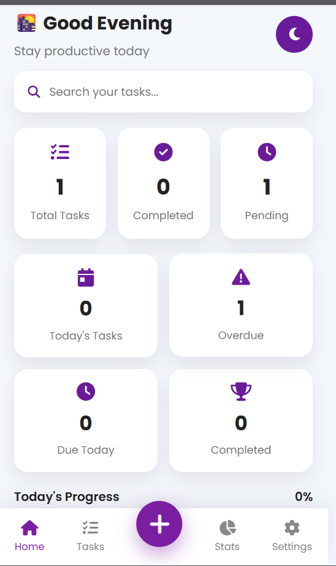
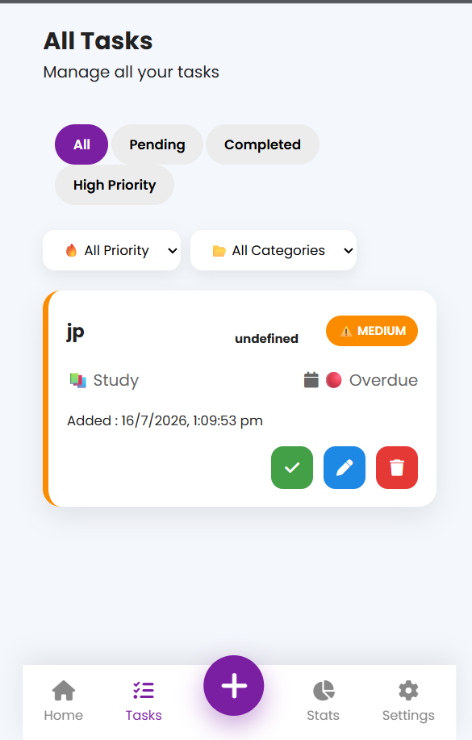
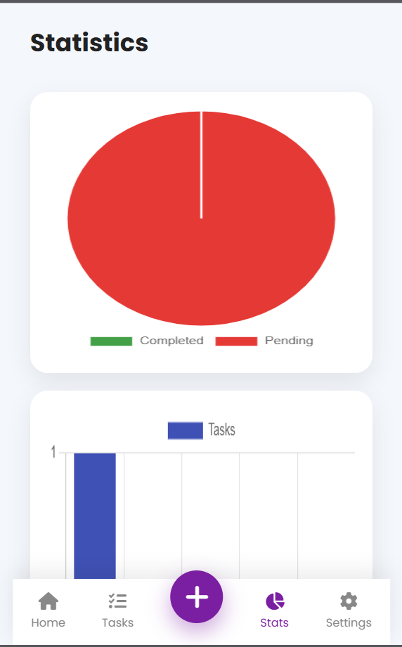
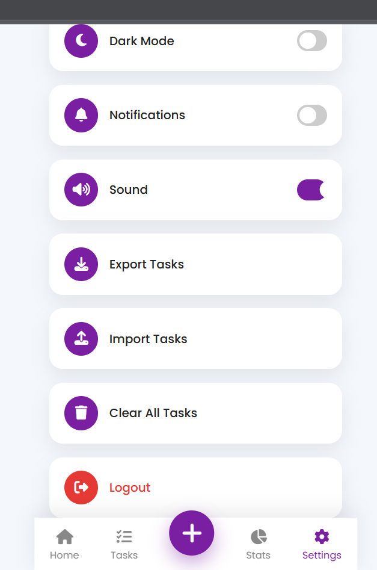
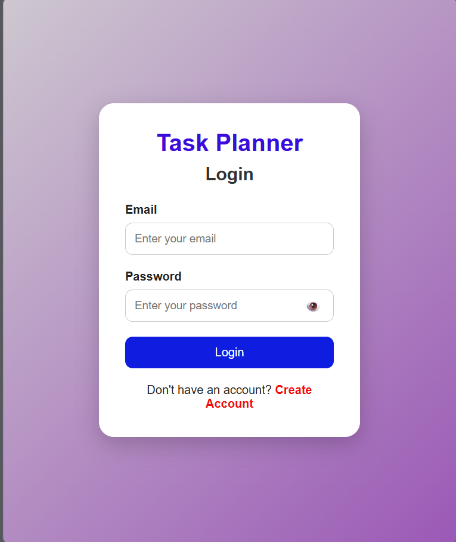
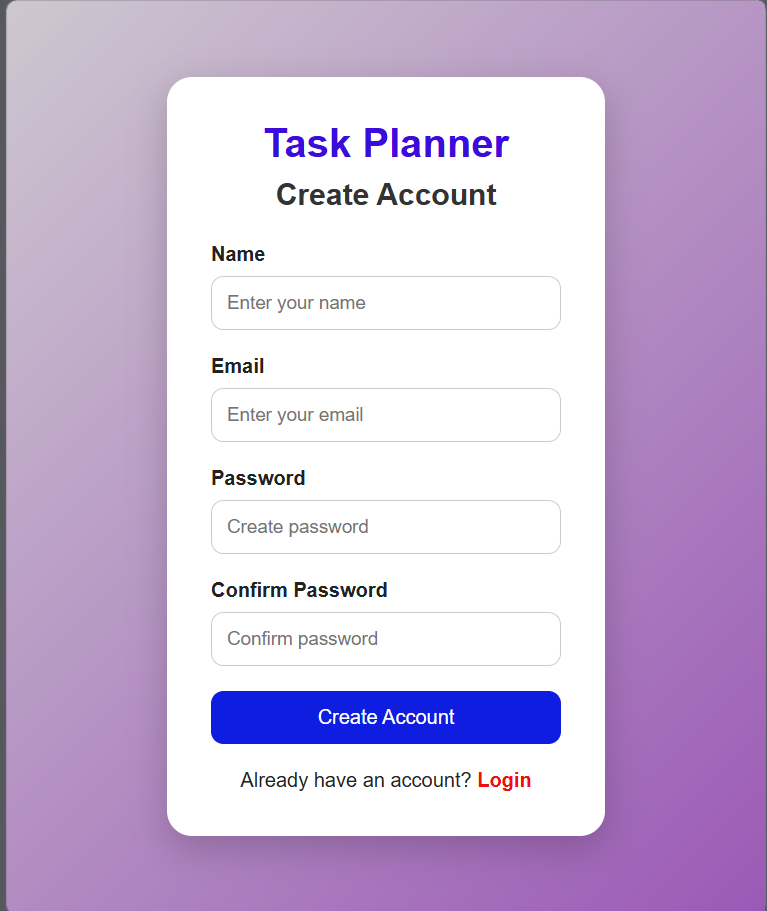

# 📋 Task Planner Pro

A modern and responsive **Task Planner Progressive Web App (PWA)** built using **HTML, CSS, and JavaScript**. It helps users organize daily tasks with authentication, statistics, charts, dark mode, reminders, and more.

---

## 🚀 Live Demo

🔗 **Live Website:** 
https://pragatibhandare05-ux.github.io/Task-Planner/
---

## ✨ Features

### 🔐 Authentication
- User Signup
- User Login
- Session Management
- Protected Home Page
- Logout System
- Password Show/Hide

### 📝 Task Management
- Add Tasks
- Edit Tasks
- Delete Tasks
- Mark Tasks as Completed
- Task Categories
- Task Priorities
- Due Dates

### 📊 Dashboard
- Total Tasks
- Completed Tasks
- Pending Tasks
- Today's Tasks
- Due Today
- Overdue Tasks
- Progress Bar

### 📈 Statistics
- Pie Chart
- Bar Chart

### 🔍 Search & Filters
- Search Tasks
- Filter by Category
- Filter by Priority
- Filter by Status

### 🎨 User Experience
- Dark Mode
- Responsive Design
- Toast Notifications
- Daily Greeting
- Motivational Quotes

### 📱 Progressive Web App (PWA)
- Installable App
- Works like a Mobile Application
- Home Screen Shortcut
- Manifest Support

---

# 🛠️ Built With

- HTML5
- CSS3
- JavaScript (ES6)
- LocalStorage
- Chart.js
- Font Awesome

---

# 📂 Project Structure

```text
Task-Planner/
│
├── index.html
├── login.html
├── signup.html
├── style.css
├── script.js
├── auth.js
├── signup.js
├── manifest.json
├── icons/
└── README.md
```
# 📷 Screenshots

## 🏠 Home

---

## 📝 Tasks


---

## 📊 Statistics


---

## ⚙️ Settings

---

## 🔐 Login


---

## 👤 Signup

---

# 🚀 Installation

Clone the repository

```bash
git clone https://github.com/pragatibhandare05-ux/Task-Planner.git
```

Open the project folder

```bash
cd Task-Planner
```

Run using Live Server or open **index.html** in your browser.

---

# 📌 Future Improvements

- Cloud Database
- User Profiles
- Password Reset
- Email Verification
- Task Sharing
- Calendar Integration
- Drag & Drop Tasks
- Recurring Tasks
- Offline Synchronization

---

# 👩‍💻 Author

**Pragati Bhandare**

Computer Engineering Student

GitHub: https://github.com/pragatibhandare05-ux

# ⭐ Support

If you like this project, please consider giving it a ⭐ on GitHub.